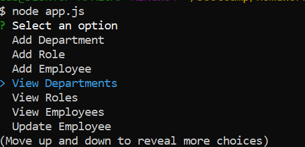
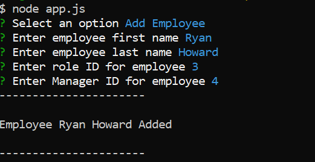
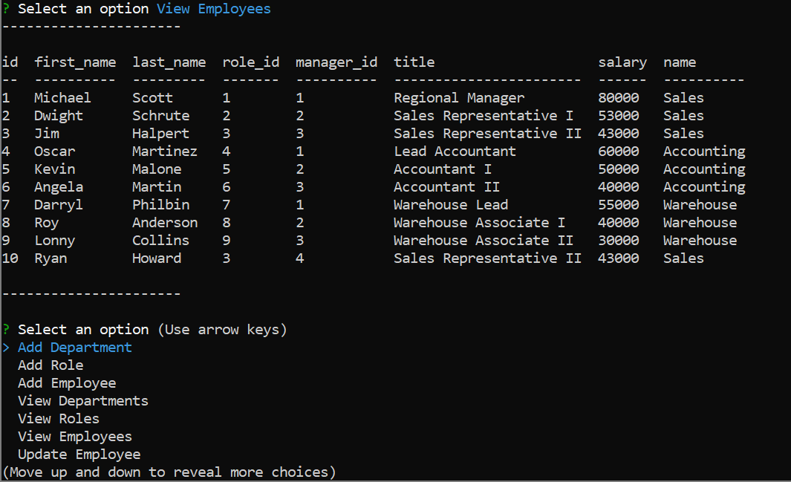
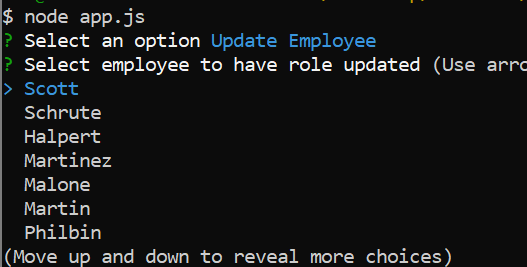
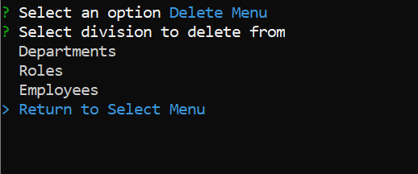

# Employee-Tracker

  


## Brief Description
This is a CLI application to add, retrieve, update, and delete data pertaining to a group of employees that is stored in an MySQL database called ```employee_tracker```.  Using NPM Inquirer a user can navigate through a menu to select one of the following options:

* Add Department/Role/Employee - *Allows a user to add a new department, role, or employee to the ```employee_tracker``` MySQL database.*

* View Department/Role/Employee - *Upon selection, a table of all departments, roles, and employees from the ```employee_tracker``MySQL database is returned to the user in their terminal.*

* Update Employee Role - *This feature allows a user to update the role of an employee currently in the ```employee_tracker``MySQL database.*

* Delete Department/Role/Employee - *When the ```Delete Menu``` option is selected from the main menu prompt, another prompt asking the user what they would like to delete (a department, role, or employee) is shown.  From there a user is returned with a list of either departments, roles, and employees.  When a user selects an item from the list it is deleted from the the ```employee_tracker``MySQL database and an updated table of either departments, roles, and employees is returned.*

* Quit - *When selected the application's connection ends with the MySQL database ends and the user is returned back to their terminal on a new line.*

## Technologies Used

* [JavaScript](https://developer.mozilla.org/en-US/docs/Web/JavaScript) - This application is written and programmed using ES6 JavaScript.

* [Node.js](https://nodejs.org/en/about/) - Used to execute code for application.

* [NPM Inquirer](https://www.npmjs.com/package/inquirer) - NPM package used to prompt user with inputs/questions/lists on the command line.

* [NPM MySQL](https://www.npmjs.com/package/MySQL) - NPM package used to make connect with MySQL database.

* [NPM Console.Table](https://www.npmjs.com/search?q=console.table) - Used to display tables in the console in a more aesthetically pleasing manner.

* [NPM dotenv](https://www.npmjs.com/package/dotenv) - Module to load variables in ```.env``` file.

* [MySQL Workbench](https://www.mysql.com/products/workbench/) - MySQL GUI used to architect, test, and manage ```employee_tracker``` MySQL database.

## Installation

#### After a user clones the repository, they will need to install the NPM packages associated with the application by running ```npm install```.  The user will then need to duplicate the ```schema.sql``` and ```seeds.sql``` files in their MySQL GUI to create the ```employee_tracker``` database.  
#### Finally, a user can launch the application by running ```node app.js``` in their terminal.

## Preview











## License
MIT License

Copyright (c) 2020 Augustus Heptig

Permission is hereby granted, free of charge, to any person obtaining a copy
of this software and associated documentation files (the "Software"), to deal
in the Software without restriction, including without limitation the rights
to use, copy, modify, merge, publish, distribute, sublicense, and/or sell
copies of the Software, and to permit persons to whom the Software is
furnished to do so, subject to the following conditions:

The above copyright notice and this permission notice shall be included in all
copies or substantial portions of the Software.

THE SOFTWARE IS PROVIDED "AS IS", WITHOUT WARRANTY OF ANY KIND, EXPRESS OR
IMPLIED, INCLUDING BUT NOT LIMITED TO THE WARRANTIES OF MERCHANTABILITY,
FITNESS FOR A PARTICULAR PURPOSE AND NONINFRINGEMENT. IN NO EVENT SHALL THE
AUTHORS OR COPYRIGHT HOLDERS BE LIABLE FOR ANY CLAIM, DAMAGES OR OTHER
LIABILITY, WHETHER IN AN ACTION OF CONTRACT, TORT OR OTHERWISE, ARISING FROM,
OUT OF OR IN CONNECTION WITH THE SOFTWARE OR THE USE OR OTHER DEALINGS IN THE
SOFTWARE.
## Contributors/Authors

* Augustus Heptig - Author/Creator